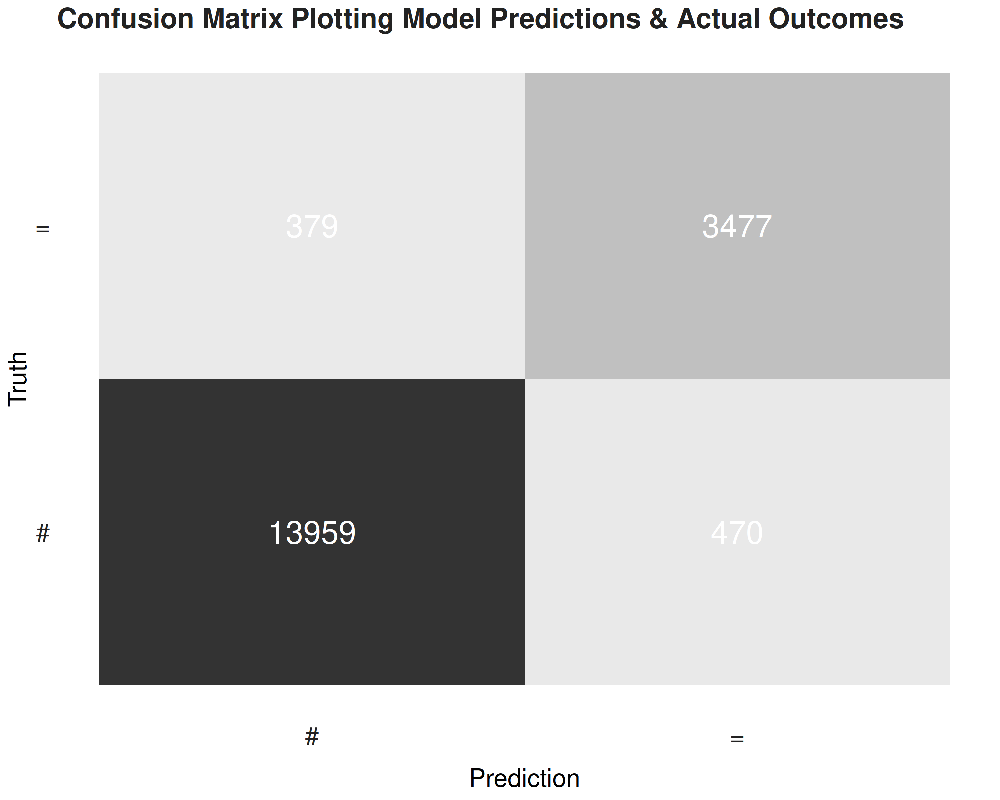

# Volleyball Analytics

Computing expected value metrics for volleyball, with the aim of assigning probabilistic values to individual plays.

## Contents

- [Requirements](#requirements)
- [Current Results](#current-results)
- [Project Plans](#project-plans)
  - [Status](#status)
  - [TODOs](#todos)
- [License](#license)
- [Contact](#contact)

## Requirements

The script used to develop the expected points model is based on the tidyverse, using the meta-packages [tidyverse](https://www.tidyverse.org/) and [tidymodels](https://www.tidymodels.org), as well as [bbplot](https://github.com/bbc/bbplot) for formatting the figures. Installing and loading both packages can be done as follows:

````r
# install pacman for package management
install.packages("pacman")

# load (and install) packages
pacman::p_install(tidyverse, tidymodels, bbplot)

````

Pacman is not required, as there are alternative routes. However, this is my preferred way of managing packages in R.

## Current Results

Preliminary results have produced relatively high test accuracy:

| Name                                 | Accuracy | Precision | Recall | F1 Score |
| ------------------------------------ | -------- | --------- | ------ | -------- |
| Extreme Gradient Boosting (XGBoost)  | 95.4%    | 97.4%     | 96.7%  | 97%      |

The following confusion matrix plots the predicted and actual outcomes:



## Project Plans

### Status

This project is still in progress. Current models are in the early stages of development.

### TODOs

Current TODOs for future development:

- [ ] Tune model hyperparameters to improve performance
- [ ] Expand scope of model to include all attack outcomes
- [ ] Visualize model performance
- [ ] Further model testing

## License

The data for this project is licensed under the [Creative Commons Attribution 3.0 Unported license](https://creativecommons.org/licenses/by/3.0/), and the code used to train the models is licensed under the [MIT license](LICENSE.md).

## Contact

If you have any questions or comments, feel free to contact [me](https://github.com/paulj1989) by [email](mailto:paul@paulrjohnson.net), on [Twitter](https://twitter.com/paul_johnson89), or in the [repository discussions](https://github.com/Paulj1989/volleyball-analytics/discussions).
