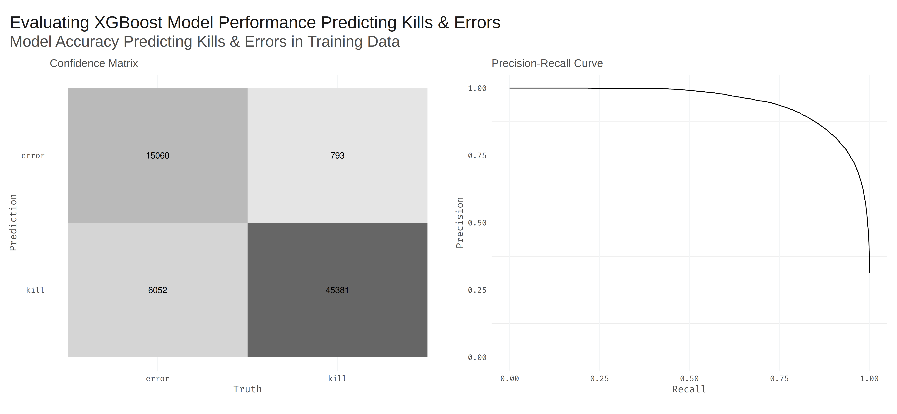
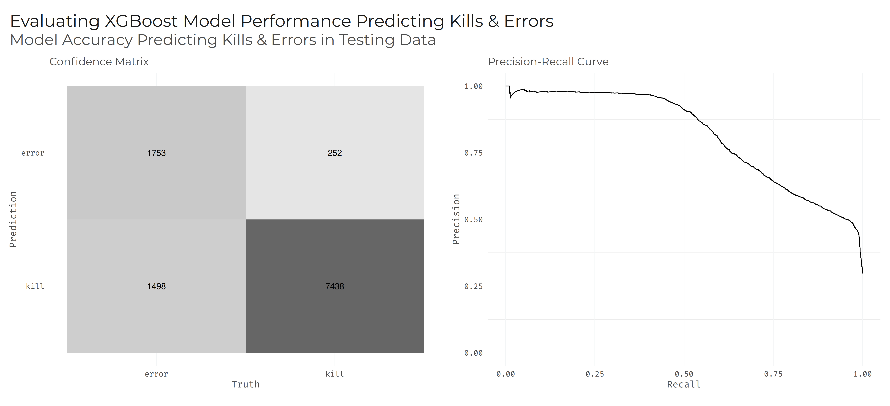
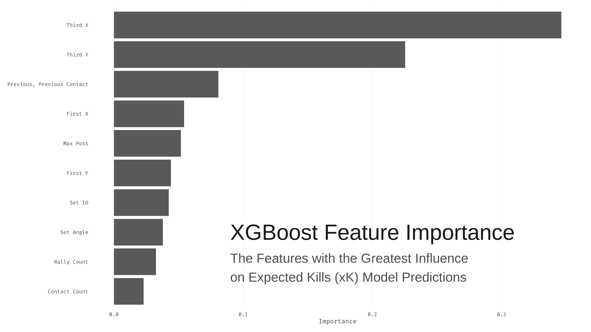

# Volleyball Analytics

Computing expected value metrics for volleyball, with the aim of assigning probabilistic values to offensive plays.

The first stages of the analysis is an Extreme Gradient Boosting (XGBoost) model that computes Expected Kills (xK).
## Contents

- [Requirements](#requirements)
- [Model Results](#model-results)
  - [Training](#training)
  - [Testing](#testing)
  - [Feature Importance](#feature-importance)
- [Project Plans](#project-plans)
  - [TODOs](#todos)
- [License](#license)
- [Contact](#contact)

## Requirements

The script used to develop the expected kills model is based on the tidyverse, using the meta-packages [tidyverse](https://www.tidyverse.org/) and [tidymodels](https://www.tidymodels.org). There are also several supplementary packages used in the R script: patchwork, doParallel, yaml.

Installing and loading all packages can be done as follows:

````r
# install pacman for package management
install.packages("pacman")

# load (and install) packages
pacman::p_install(tidymodels, tidyverse, patchwork, doParallel, yaml)

````

There are alternatives to pacman, but this is my preferred means of package management.
## Model Results

Preliminary results have produced relatively high test accuracy:

| XGBoost Model     | Accuracy | Precision | Recall | F1 Score |
| ----------------- | -------- | --------- | ------ | -------- |
| Training          | 89.8%    | 88.2%     | 98.3%  | 93%      |
| Testing           | 85.6%    | 85.2%     | 95.7%  | 90.1%    |

The following figures plot the model results on the train and test data:

### Training



### Testing



### Feature Importance



## Project Plans

This project is still in progress. Current models are in the early stages of development.

### TODOs

- [x] Tune model hyperparameters to improve performance
- [x] Visualize model performance
- [x] Further model testing
- [ ] Write full notebook detailing how to carry out the xK model
- [ ] Develop probabilistic measure of the Expected Value (eV) or Expected Value Added (eVA) of all offensive plays

## License

The data for this project is licensed under the [Creative Commons Attribution 3.0 Unported license](https://creativecommons.org/licenses/by/3.0/), and the code used to train the models is licensed under the [MIT license](LICENSE.md).

## Contact

If you have any questions or comments, feel free to contact [me](https://github.com/paulj1989) by [email](mailto:paul@paulrjohnson.net), on [Twitter](https://twitter.com/paul_johnson89), or in the [repository discussions](https://github.com/Paulj1989/volleyball-analytics/discussions).
