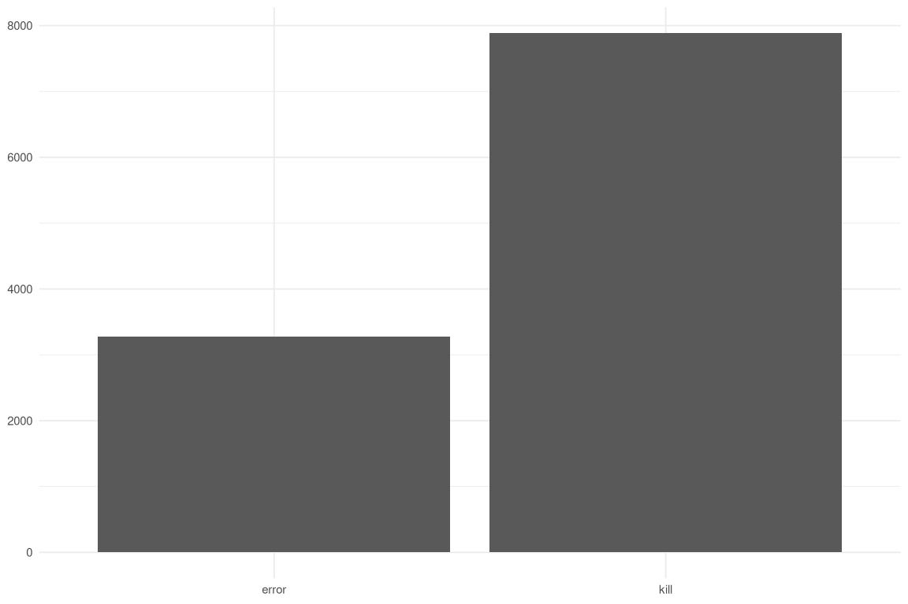
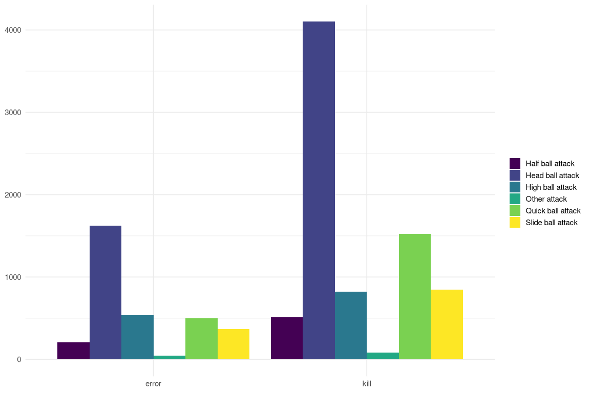
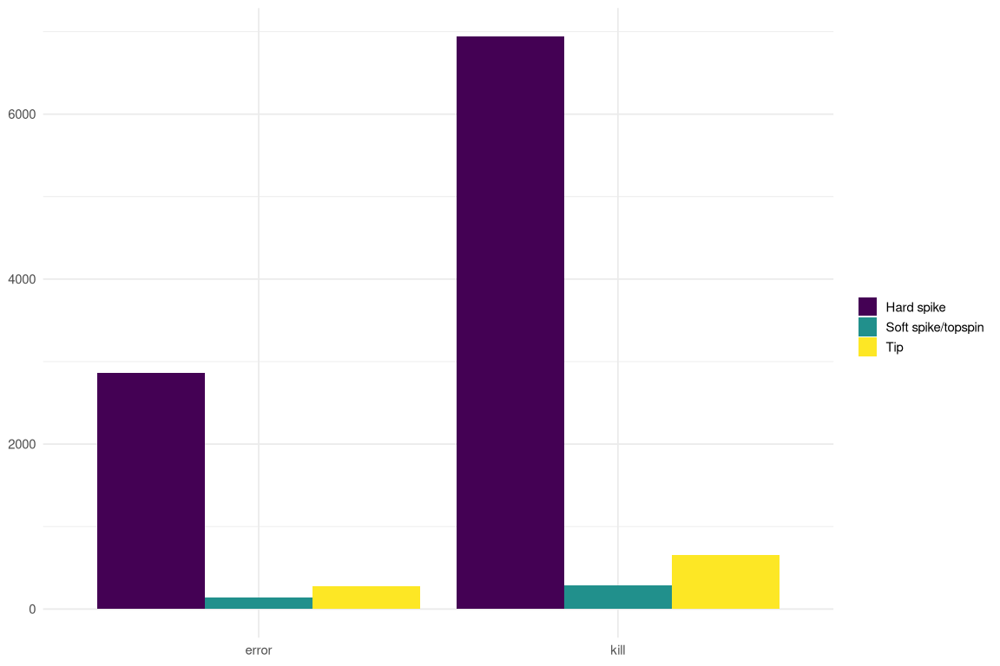
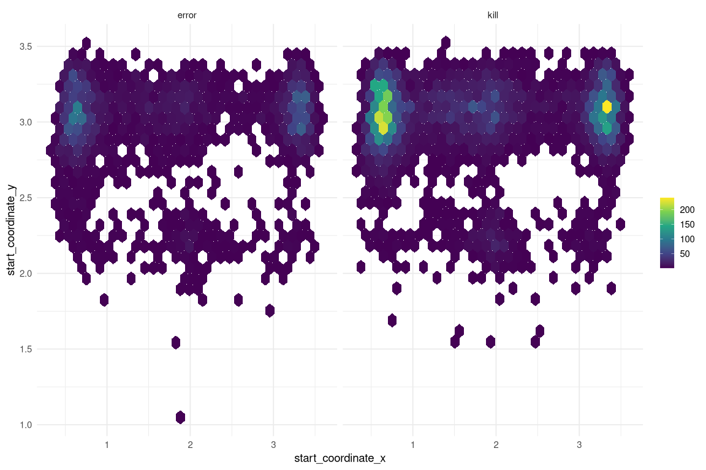
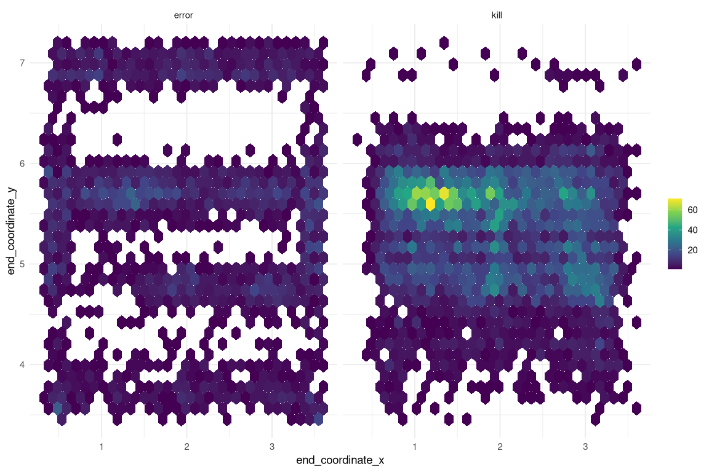
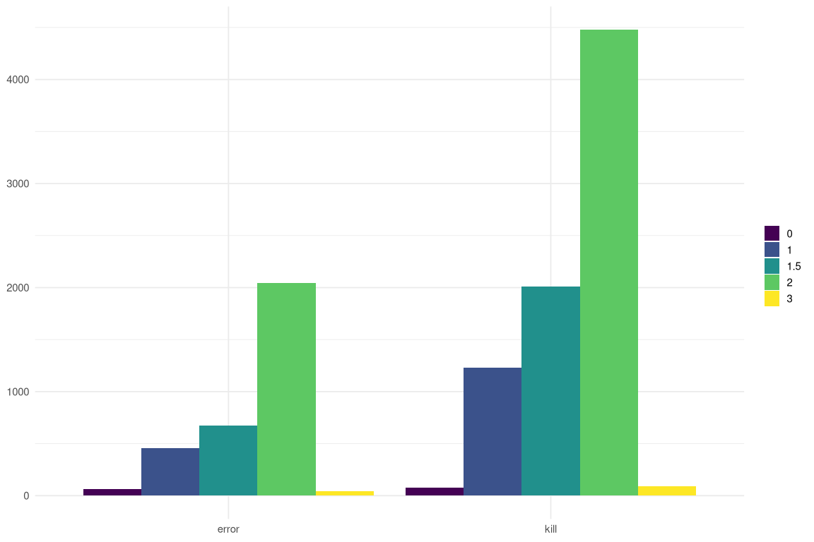
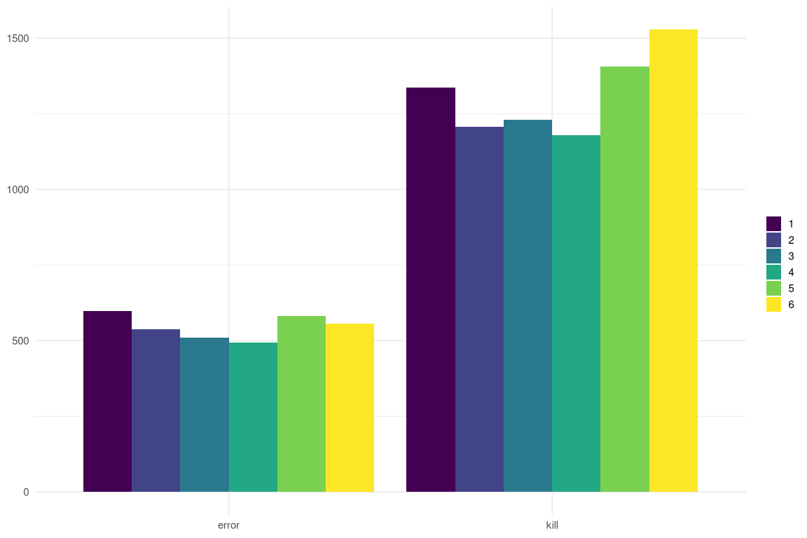
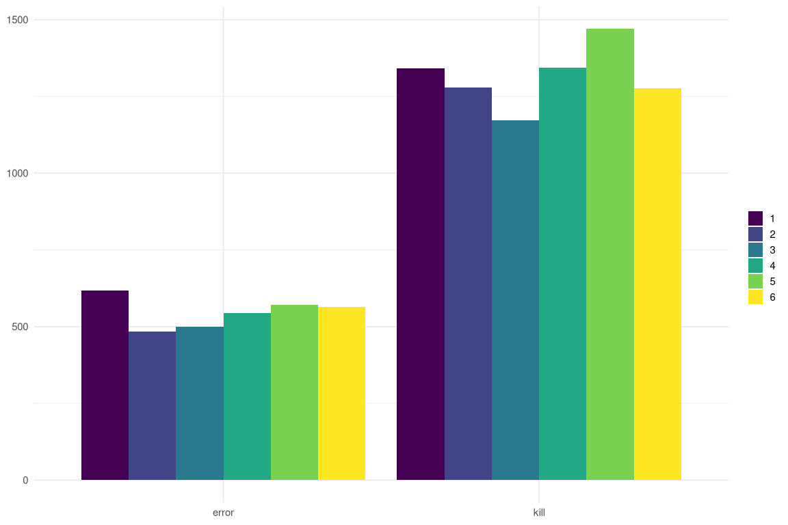

Exploring Data & Identifying Model Features
================
Paul Johnson
2022-09-07

- <a href="#understanding-the-structure-of-the-data"
  id="toc-understanding-the-structure-of-the-data">Understanding the
  Structure of the Data</a>
- <a href="#visualizing-the-binary-target"
  id="toc-visualizing-the-binary-target">Visualizing the Binary Target</a>
- <a href="#feature-exploration-extraction"
  id="toc-feature-exploration-extraction">Feature Exploration &amp;
  Extraction</a>
  - <a href="#skill-type" id="toc-skill-type">Skill Type</a>
  - <a href="#skill-subtype" id="toc-skill-subtype">Skill Subtype</a>
  - <a href="#start-end-locations" id="toc-start-end-locations">Start &amp;
    End Locations</a>
  - <a href="#blockers" id="toc-blockers">Blockers</a>
  - <a href="#teamopponent-setter-position"
    id="toc-teamopponent-setter-position">Team/Opponent Setter Position</a>
  - <a href="#rotation" id="toc-rotation">Rotation</a>
  - <a href="#contact" id="toc-contact">Contact</a>

The first step is to carry out Exploratory Data Analysis (EDA), with the
intention of gaining an understanding of how the data is structured,
identifying any issues in the data that need to be resolved, and
identifying and extracting any potential features for the model.

# Understanding the Structure of the Data

``` r
# take a look at the training set
glimpse(train_df)
```

    Rows: 11,165
    Columns: 15
    $ evaluation_code          <chr> "error", "error", "error", "error", "error", …
    $ skill_type               <chr> "Quick ball attack", "Quick ball attack", "He…
    $ start_zone               <dbl> 3, 4, 4, 2, 2, 2, 2, 2, 2, 4, 4, 4, 2, 4, 2, …
    $ end_zone                 <dbl> 1, 3, 6, 1, 7, 8, 7, 1, 7, 6, 1, 9, 9, 7, 5, …
    $ end_subzone              <chr> "A", "B", "B", "D", "B", "C", "B", "A", "B", …
    $ skill_subtype            <chr> "Hard spike", "Hard spike", "Hard spike", "Ha…
    $ blockers                 <dbl> 3.0, 1.0, 2.0, 2.0, 2.0, 1.5, 2.0, 1.5, 1.0, …
    $ team_setter_position     <dbl> 3, 1, 1, 5, 3, 3, 4, 3, 4, 3, 2, 6, 5, 5, 2, …
    $ opponent_setter_position <dbl> 2, 4, 2, 6, 4, 1, 5, 1, 3, 2, 2, 6, 5, 5, 4, …
    $ start_coordinate_x       <dbl> 1.68125, 1.49375, 0.70625, 3.21875, 3.25625, …
    $ start_coordinate_y       <dbl> 3.129630, 3.055556, 2.981481, 2.907407, 2.981…
    $ end_coordinate_x         <dbl> 0.55625, 1.60625, 1.64375, 1.15625, 2.88125, …
    $ end_coordinate_y         <dbl> 6.981481, 3.722222, 5.648148, 6.907407, 4.611…
    $ contact                  <dbl> 3, 3, 3, 3, 3, 3, 3, 3, 3, 3, 3, 3, 3, 3, 3, …
    $ rotation                 <chr> "Ro 5", "Ro 1", "Ro 1", "Ro 3", "Ro 5", "Ro 5…

There are plenty of observations (11,165 rows), and we’ve got 15
columns, which means 1 target variable and 14 potential features,
however, part of the earlier data processing step was selecting
variables that could be relevant to predicting kills, so the 14
variables should be promising.

The majority of the variables are numeric and the rest are character
variables. From an initial look at the numeric values, it doesn’t look
like there’s a huge range and everything is more on less on the same
scale, which is good news.

Several of the character variables look like they could be transformed
to be more useful. For example, the rotation variable looks like it
should probably be a numeric variable instead.

# Visualizing the Binary Target

The target variable is *evaluation_code*. Though in the raw data it
isn’t a binary variable, we are interested in just two of the variable’s
values (kills and errors) so it was transformed in the initial
processing step. Kills are the positive event level (points scored by
the team making the play), while errors are the negative event level.

``` r
train_df %>%
  tabyl(evaluation_code)
```

     evaluation_code    n   percent
               error 3281 0.2938648
                kill 7884 0.7061352

The target classes are relatively imbalanced, which could be a problem.
The classes are split \~70/30, with kills being the majority class. This
means that our models are at risk of overprescribing kills in the
predictions, because machine learning algorithms like to take shortcuts!
If a model was to predict that every outcome will be a kill, it would be
right \~70% of the time.

``` r
train_df %>%
  ggplot(aes(evaluation_code)) +
  geom_bar(position = "dodge") +
  scale_fill_viridis_d() +
  labs(x = NULL, y = NULL, fill = NULL)
```



The bar plot probably does a better job of demonstrating how significant
the imbalance is between kills and errors. It will be necessary to
explore options for how to negate the negative effects of class
imbalance.

# Feature Exploration & Extraction

## Skill Type

Skill type seems like one of the most likely variables to contain
significant predictive power. The type of attack seems like it should
contain information about the conditional probability of success.

``` r
train_df %>%
  tabyl(skill_type)
```

            skill_type    n    percent
      Half ball attack  714 0.06394984
      Head ball attack 5727 0.51294223
      High ball attack 1358 0.12163009
          Other attack  129 0.01155396
     Quick ball attack 2020 0.18092253
     Slide ball attack 1217 0.10900134

Just over 50% of the skill type’s are head ball attacks, while the
remaining 50% is mostly split between quick ball attacks, high ball
attacks, and slide ball attacks. The distribution of the skill types
seems pretty reasonable (despite the overwhelming dominance of head ball
attacks), as it’s only ‘other attack’ that is really poorly represented.

*I’ve created functions to plot the different charts to avoid
repetition. The functions can be found in ‘\~/src/functions’.*

``` r
plot_bars(skill_type)
```



It looks like there’s some variance in skill type split by the outcome.

``` r
train_df %>%
  tabyl(skill_type, evaluation_code) %>%
  adorn_percentages()
```

            skill_type     error      kill
      Half ball attack 0.2871148 0.7128852
      Head ball attack 0.2839183 0.7160817
      High ball attack 0.3961708 0.6038292
          Other attack 0.3720930 0.6279070
     Quick ball attack 0.2460396 0.7539604
     Slide ball attack 0.3015612 0.6984388

It’s a little easier to make sense of this by looking at the skill type
percentages split by outcome. Given that kills and errors are split
\~70/30, we can compare skill types that have higher or lower
proportions.

- Head ball attacks lead to \~2% higher than average kills, but that
  difference is potentially meaningful.
- Slide ball attacks lead to a little bit less than 2% fewer kills
  (which was hard to infer from the plot).
- Quick ball attacks result in \~6% more kills than average.
- High ball attacks and other attacks tend to produce worse than average
  outcomes (I’m guessing that the other attacks come as a result of
  limited options available to the attacking team).

All this suggests there’s definitely some predictive power in this
feature.

## Skill Subtype

In addition to skill types, skill subtypes could also contain some
useful variance and potentially some predictive power.

``` r
train_df %>%
  tabyl(skill_subtype)
```

          skill_subtype    n    percent
             Hard spike 9804 0.87810121
     Soft spike/topspin  430 0.03851321
                    Tip  931 0.08338558

The vast majority of the subtypes are hard spikes (\~88%), which limits
how useful this feature can be.

``` r
plot_bars(skill_subtype)
```



It’s also pretty difficult to draw anything from the subtype plot,
because of how overrepresented hard spikes are.

``` r
train_df %>%
  tabyl(skill_subtype, evaluation_code) %>%
  adorn_percentages()
```

          skill_subtype     error      kill
             Hard spike 0.2922277 0.7077723
     Soft spike/topspin 0.3232558 0.6767442
                    Tip 0.2975295 0.7024705

However, the trusty proportions can help us here! It looks like all
three subtypes are pretty close to the average outcome proportions, but
soft spikes/topspins do produce a \~2% lower than average kills.

I don’t think subtypes will be entirely useless here, but the value in
including it as a feature in our model is certainly limited.

**Perhaps we can draw out more information if we interact the skill
subtype with the skill type?**

## Start & End Locations

There are a total of seven variables that represent the location of
points in the play. It’s unlikely that we will be able to use all seven
of these, so it’s a case of identifying which will tell us the most.

There’s a subset of four location variables that correspond to x and y
coordinates, and the other three are locations binned in to zones.

I think we gain more from the x, y coordinates than the zones and
subzones. The more variance the better in this case.

``` r
plot_coordinates(start_coordinate_x, start_coordinate_y)
```



``` r
plot_coordinates(end_coordinate_x, end_coordinate_y)
```



It’s very clear that the end coordinates vary meaningfully, however,
it’s less clear that there’s anything important going on with the start
coordinates.

I think this is because there’s simply less variance in the start
coordinates, so it’s harder to draw out information from it.

## Blockers

``` r
train_df %>%
  tabyl(blockers)
```

     blockers    n    percent
          0.0  138 0.01236005
          1.0 1686 0.15100761
          1.5 2682 0.24021496
          2.0 6524 0.58432602
          3.0  135 0.01209136

``` r
train_df %>%
  tabyl(blockers, evaluation_code) %>%
  adorn_percentages()
```

     blockers     error      kill
          0.0 0.4492754 0.5507246
          1.0 0.2698695 0.7301305
          1.5 0.2505593 0.7494407
          2.0 0.3137646 0.6862354
          3.0 0.3333333 0.6666667

``` r
plot_bars(as.factor(blockers))
```



There’s plenty of variance across different numbers of blockers, which
isn’t especially surprising.

## Team/Opponent Setter Position

``` r
train_df %>%
  tabyl(team_setter_position)
```

     team_setter_position    n   percent
                        1 1933 0.1731303
                        2 1746 0.1563815
                        3 1740 0.1558442
                        4 1674 0.1499328
                        5 1987 0.1779669
                        6 2085 0.1867443

``` r
train_df %>%
  tabyl(team_setter_position, evaluation_code) %>%
  adorn_percentages()
```

     team_setter_position     error      kill
                        1 0.3088464 0.6911536
                        2 0.3087056 0.6912944
                        3 0.2936782 0.7063218
                        4 0.2956989 0.7043011
                        5 0.2929039 0.7070961
                        6 0.2671463 0.7328537

``` r
train_df %>%
  tabyl(opponent_setter_position, evaluation_code) %>%
  adorn_percentages()
```

     opponent_setter_position     error      kill
                            1 0.3149566 0.6850434
                            2 0.2747875 0.7252125
                            3 0.2990431 0.7009569
                            4 0.2882883 0.7117117
                            5 0.2794118 0.7205882
                            6 0.3067318 0.6932682

``` r
plot_bars(as.factor(team_setter_position))
```



``` r
plot_bars(as.factor(opponent_setter_position))
```



There isn’t tons of variance across different values of team and
opponent setter position, though it’s possible that these small
differences matter. There appears to be slightly more variance across
opponent setter position, though it’s not clear if this is by chance.

**Do the two have meaningful interactions?**

## Rotation

``` r
train_df %>%
  tabyl(rotation)
```

     rotation    n   percent
         Ro 1 1933 0.1731303
         Ro 2 2085 0.1867443
         Ro 3 1987 0.1779669
         Ro 4 1674 0.1499328
         Ro 5 1740 0.1558442
         Ro 6 1746 0.1563815

``` r
train_df %>%
  tabyl(rotation, evaluation_code) %>%
  adorn_percentages()
```

     rotation     error      kill
         Ro 1 0.3088464 0.6911536
         Ro 2 0.2671463 0.7328537
         Ro 3 0.2929039 0.7070961
         Ro 4 0.2956989 0.7043011
         Ro 5 0.2936782 0.7063218
         Ro 6 0.3087056 0.6912944

Rotation is just another representation of team setter position.

## Contact

``` r
train_df %>%
  tabyl(contact)
```

     contact     n      percent
           2     9 0.0008060905
           3 11156 0.9991939095

There’s virtually no variation across the three values of contact (1, 2,
3). Of 11,165 observations only 11 do not equal 3.
