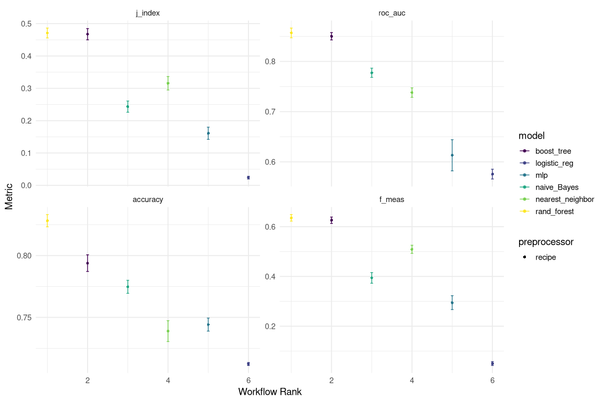

Training & Identifying Best Performing Models
================
Paul Johnson
2022-09-07

- <a href="#model-training" id="toc-model-training">Model Training</a>
  - <a href="#define-candidate-models"
    id="toc-define-candidate-models">Define Candidate Models</a>
  - <a href="#set-workflow-pipeline" id="toc-set-workflow-pipeline">Set
    Workflow Pipeline</a>
  - <a href="#fit-candidates-to-resamples"
    id="toc-fit-candidates-to-resamples">Fit Candidates to Resamples</a>
  - <a href="#evaluate-performance" id="toc-evaluate-performance">Evaluate
    Performance</a>

This notebook carries out the training process for the candidate models
and evaluates performance for each one, helping to select a small subset
of models that can be optimized and evaluated further.

# Model Training

## Define Candidate Models

There are a number of different algorithms that might prove to be the
best approach to predicting outcomes in volleyball. We want to test the
performance of the basic form of several of these algorithms in order to
identify the candidates for the tuning process.

We will try the following algorithms:

- Logistic Regression
- Naive Bayes
- K-Nearest Neighbours (KNN)
- Neural Network
- Random Forest
- XGBoost

``` r
# logistic regression
log_mod <- 
  logistic_reg(
    penalty = 0.2
  ) %>%
  set_mode('classification') %>%
  set_engine('glm')

# naive bayes
nb_mod <-
  naive_Bayes() %>%
  set_mode('classification') %>%
  set_engine('klaR')

# knn
knn_mod <- 
  nearest_neighbor() %>% 
  set_mode("classification") %>%
  set_engine("kknn")

# nnet
nnet_mod <- 
  mlp() %>% 
  set_mode("classification") %>%
  set_engine("keras",
             verbose = FALSE)

# random forest
rf_mod <-
  rand_forest(
    trees = 1000
  ) %>%
  set_mode("classification") %>%
  set_engine("ranger")

# xgboost
xgb_mod <-
  boost_tree(
    trees = 1000,
    stop_iter = 10
  ) %>%
  set_mode("classification") %>%
  set_engine("xgboost")
```

## Set Workflow Pipeline

``` r
# specify the workflow set
model_pipeline <- 
   workflow_set(
     # preprocessing steps
      preproc = list(model_rec),
      # models to be trained
      models = 
        list(
          log = log_mod,
          nb = nb_mod,
          knn = knn_mod,
          nnet = nnet_mod,
          rf = rf_mod,
          xgb = xgb_mod)
   ) %>%
  # simplify workflow id for each model
  mutate(wflow_id = gsub("(recipe_)", "", wflow_id))
```

## Fit Candidates to Resamples

``` r
# fit models on resamples
train_models <-
  model_pipeline %>%
  # map across all preprocessing steps and models in workflow set
   workflow_map(
     "fit_resamples",
     # set seed for reproducibility
     seed = 456,
     # identify resamples
     resamples = train_folds,
     # metrics for evaluating performance
     metrics = eval_metrics,
     # log results throughout training process
     verbose = TRUE)
```

``` r
readr::write_rds(train_models, here::here("data", "trained_models.rds"))
```

The Logistic Regression is producing predictions from a “rank-deficient
fit”. I think this means there are multicollinearity issues going on.
I’m not sure what the source of the problem is.

## Evaluate Performance

We can evaluate model performance using the {workflowsets} function
*rank_results()* but getting results that are easily intuited can be a
little fiddly, so we will use a custom function *evaluate_performance()*
that is defined in the functions directory.

``` r
train_models %>%
  evaluate_performance("roc_auc")
```

    # A tibble: 6 × 9
      wflow_id .config          .metric  mean std_err     n preprocessor model  rank
      <chr>    <chr>            <chr>   <dbl>   <dbl> <int> <chr>        <chr> <int>
    1 rf       Preprocessor1_M… roc_auc 0.857 0.00591    10 recipe       rand…     1
    2 xgb      Preprocessor1_M… roc_auc 0.850 0.00444    10 recipe       boos…     2
    3 nb       Preprocessor1_M… roc_auc 0.777 0.00553    10 recipe       naiv…     3
    4 knn      Preprocessor1_M… roc_auc 0.738 0.00569    10 recipe       near…     4
    5 nnet     Preprocessor1_M… roc_auc 0.613 0.0188     10 recipe       mlp       5
    6 log      Preprocessor1_M… roc_auc 0.576 0.00589    10 recipe       logi…     6

``` r
train_models %>%
  evaluate_performance("accuracy")
```

    # A tibble: 6 × 9
      wflow_id .config          .metric  mean std_err     n preprocessor model  rank
      <chr>    <chr>            <chr>   <dbl>   <dbl> <int> <chr>        <chr> <int>
    1 rf       Preprocessor1_M… accura… 0.828 3.01e-3    10 recipe       rand…     1
    2 xgb      Preprocessor1_M… accura… 0.794 4.10e-3    10 recipe       boos…     2
    3 nb       Preprocessor1_M… accura… 0.775 3.20e-3    10 recipe       naiv…     3
    4 nnet     Preprocessor1_M… accura… 0.744 3.21e-3    10 recipe       mlp       4
    5 knn      Preprocessor1_M… accura… 0.739 5.13e-3    10 recipe       near…     5
    6 log      Preprocessor1_M… accura… 0.712 7.40e-4    10 recipe       logi…     6

``` r
train_models %>%
  evaluate_performance("f_meas")
```

    # A tibble: 6 × 9
      wflow_id .config         .metric   mean std_err     n preprocessor model  rank
      <chr>    <chr>           <chr>    <dbl>   <dbl> <int> <chr>        <chr> <int>
    1 rf       Preprocessor1_… f_meas  0.636  0.00798    10 recipe       rand…     1
    2 xgb      Preprocessor1_… f_meas  0.626  0.00781    10 recipe       boos…     2
    3 knn      Preprocessor1_… f_meas  0.509  0.00992    10 recipe       near…     3
    4 nb       Preprocessor1_… f_meas  0.394  0.0130     10 recipe       naiv…     4
    5 nnet     Preprocessor1_… f_meas  0.295  0.0170     10 recipe       mlp       5
    6 log      Preprocessor1_… f_meas  0.0501 0.00485    10 recipe       logi…     6

``` r
train_models %>%
  evaluate_performance("j_index")
```

    # A tibble: 6 × 9
      wflow_id .config         .metric   mean std_err     n preprocessor model  rank
      <chr>    <chr>           <chr>    <dbl>   <dbl> <int> <chr>        <chr> <int>
    1 rf       Preprocessor1_… j_index 0.471  0.00928    10 recipe       rand…     1
    2 xgb      Preprocessor1_… j_index 0.467  0.0106     10 recipe       boos…     2
    3 knn      Preprocessor1_… j_index 0.316  0.0126     10 recipe       near…     3
    4 nb       Preprocessor1_… j_index 0.243  0.0105     10 recipe       naiv…     4
    5 nnet     Preprocessor1_… j_index 0.161  0.0115     10 recipe       mlp       5
    6 log      Preprocessor1_… j_index 0.0239 0.00254    10 recipe       logi…     6

``` r
# visualize performance across all metrics
autoplot(train_models) +
    scale_color_viridis_d()
```



Summarizing performance:

- The Logistic Regression is performing pretty poorly on all of the
  evaluation metrics.
- The Neural Network (MLP) is lagging pretty far behind the best
  performing models too. However there is significant variance across
  the metrics and the large confidence intervals. There’s a good chance
  that this model would improve significantly if optimized (though the
  fact it is lagging far behind suggests it’s not worth it).
- The KNN and the Naive Bayes are performing pretty well, though are
  generally further behind the best candidates.
- The Random Forest and XGBoost are performing significantly better than
  the other candidates, across the four metrics.
