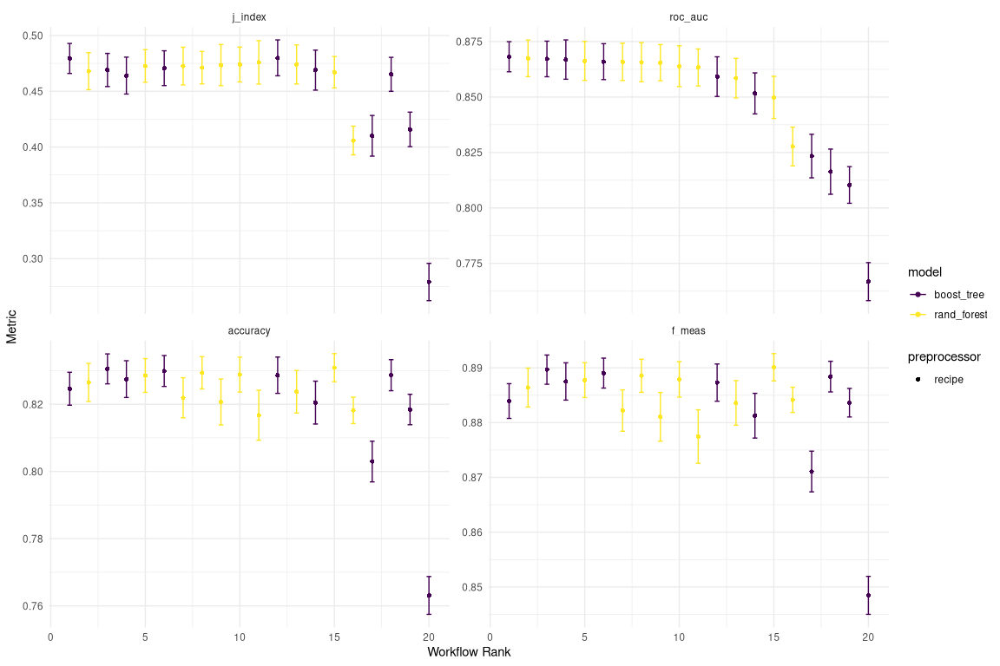

Optimizing & Testing the Best Performing Models
================
Paul Johnson
2022-09-07

- <a href="#hyperparameter-optimization"
  id="toc-hyperparameter-optimization">Hyperparameter Optimization</a>
  - <a href="#define-models-for-tuning"
    id="toc-define-models-for-tuning">Define Models for Tuning</a>
  - <a href="#set-worklow-pipeline" id="toc-set-worklow-pipeline">Set
    Worklow Pipeline</a>
  - <a href="#tune-model-hyperparameters"
    id="toc-tune-model-hyperparameters">Tune Model Hyperparameters</a>
  - <a href="#evaluate-performance" id="toc-evaluate-performance">Evaluate
    Performance</a>

Having trained the basic candidate models in the [previous
notebook](./src/03-training.Rmd) we can select a subset of models that
performed well according to our evaluation metrics. This subset of
models can then be optimized to the data by tuning their
hyperparameters. This should improve the performance of all of the
models, and the best performing model after this process can be selected
as the final model.

# Hyperparameter Optimization

Given that the Random Forest and the XGBoost have clearly outperformed
their competitors but are pretty much neck-and-neck, we can go a little
further and optimize the performance of these models by tuning the
hyperparameters for this classification problem.

While the Random Forest ended up performing slightly better on three out
of fours of the evaluation metrics, the XGBoost was actually performing
better on the primary metric we’re using, ROC-AUC. The XGBoost also has
many hyperparameters that can be tuned to improve performance, so is
perhaps more likely to see significant improvements in this optimization
stage.

<!-- We will also include the K-Nearest Neighbours (KNN) model and the Neural Network in this stage. The KNN performed pretty well and serves as a high baseline to compare the Random Forest and XGBoost models, and while the Neural Network didn't perform particularly well, it should see significant improvements (perhaps even more so than the XGBoost) when tuned. While it's unlikely to come out on top in the end, it will be interesting to include it, so we are doing so! -->

## Define Models for Tuning

``` r
# random forest
rf_mod <-
  rand_forest(
    trees = 1000,
    min_n = tune(),
    mtry = tune()) %>%
  set_mode("classification") %>%
  set_engine("ranger")

rf_params <- rf_mod %>%
  extract_parameter_set_dials() %>%
  update(mtry = finalize(mtry(), train_df))
 
# xgboost
xgb_mod <-
  boost_tree(
    trees = 1000,
    tree_depth = tune(),
    min_n = tune(),
    loss_reduction = tune(),
    sample_size = tune(),
    mtry = tune(),
    learn_rate = tune()
  ) %>%
  set_mode("classification") %>%
  set_engine("xgboost")

xgb_params <- xgb_mod %>% 
  extract_parameter_set_dials() %>%
  update(sample_size = sample_prop(),
       mtry = finalize(mtry(), train_df))
```

## Set Worklow Pipeline

``` r
model_pipeline <- 
   workflow_set(
      preproc = list(model_rec),
      models = list(
        rf = rf_mod,
        xgb = xgb_mod
        )
   ) %>%
  mutate(wflow_id = gsub("(recipe_)", "", wflow_id)) %>%
  option_add(param_info = rf_params, id = "rf") %>%
  option_add(param_info = xgb_params, id = "xgb")

model_pipeline %>%
  extract_workflow(id = "xgb")
```

    ══ Workflow ════════════════════════════════════════════════════════════════════
    Preprocessor: Recipe
    Model: boost_tree()

    ── Preprocessor ────────────────────────────────────────────────────────────────
    7 Recipe Steps

    • step_mutate()
    • step_string2factor()
    • step_other()
    • step_dummy()
    • step_interact()
    • step_corr()
    • step_nzv()

    ── Model ───────────────────────────────────────────────────────────────────────
    Boosted Tree Model Specification (classification)

    Main Arguments:
      mtry = tune()
      trees = 1000
      min_n = tune()
      tree_depth = tune()
      learn_rate = tune()
      loss_reduction = tune()
      sample_size = tune()

    Computational engine: xgboost 

## Tune Model Hyperparameters

First we need to specify the grid search process.

``` r
# specify grid search process
grid_ctrl <- tune::control_grid(
  parallel_over = "resamples",
  event_level = "second",
  verbose = FALSE,
  save_pred = TRUE,
  save_workflow = TRUE,
)
```

Then we are ready to tune the models.

``` r
# tune models
tune_models <-
  model_pipeline %>% 
  # map across all preprocessing steps and models in workflow set
   workflow_map(
     "tune_grid",
     # set seed for reproducibility
     seed = 456,
     # identify resamples
     resamples = train_folds,
     # specify grid size
     grid = 10,
     # grid search specs
     control = grid_ctrl,
     # metrics for evaluating performance
     metrics = eval_metrics,
     # log results throughout training process
     verbose = TRUE)
```

``` r
readr::write_rds(tune_models, here::here("data", "tuned_models.rds"))
```

## Evaluate Performance

``` r
tune_models %>%
  evaluate_performance("roc_auc", select_best = TRUE)
```

    # A tibble: 2 × 9
      wflow_id .config          .metric  mean std_err     n preprocessor model  rank
      <chr>    <chr>            <chr>   <dbl>   <dbl> <int> <chr>        <chr> <int>
    1 xgb      Preprocessor1_M… roc_auc 0.868 0.00413    10 recipe       boos…     1
    2 rf       Preprocessor1_M… roc_auc 0.867 0.00501    10 recipe       rand…     2

``` r
tune_models %>%
  evaluate_performance("accuracy", select_best = TRUE)
```

    # A tibble: 2 × 9
      wflow_id .config          .metric  mean std_err     n preprocessor model  rank
      <chr>    <chr>            <chr>   <dbl>   <dbl> <int> <chr>        <chr> <int>
    1 rf       Preprocessor1_M… accura… 0.831 0.00255    10 recipe       rand…     1
    2 xgb      Preprocessor1_M… accura… 0.831 0.00271    10 recipe       boos…     2

``` r
tune_models %>%
  evaluate_performance("f_meas", select_best = TRUE)
```

    # A tibble: 2 × 9
      wflow_id .config          .metric  mean std_err     n preprocessor model  rank
      <chr>    <chr>            <chr>   <dbl>   <dbl> <int> <chr>        <chr> <int>
    1 rf       Preprocessor1_M… f_meas  0.890 0.00151    10 recipe       rand…     1
    2 xgb      Preprocessor1_M… f_meas  0.890 0.00162    10 recipe       boos…     2

``` r
tune_models %>%
  evaluate_performance("j_index", select_best = TRUE)
```

    # A tibble: 2 × 9
      wflow_id .config          .metric  mean std_err     n preprocessor model  rank
      <chr>    <chr>            <chr>   <dbl>   <dbl> <int> <chr>        <chr> <int>
    1 xgb      Preprocessor1_M… j_index 0.480 0.00977    10 recipe       boos…     1
    2 rf       Preprocessor1_M… j_index 0.476 0.0118     10 recipe       rand…     2

``` r
# visualize performance across all metrics
autoplot(tune_models) +
    scale_color_viridis_d()
```


